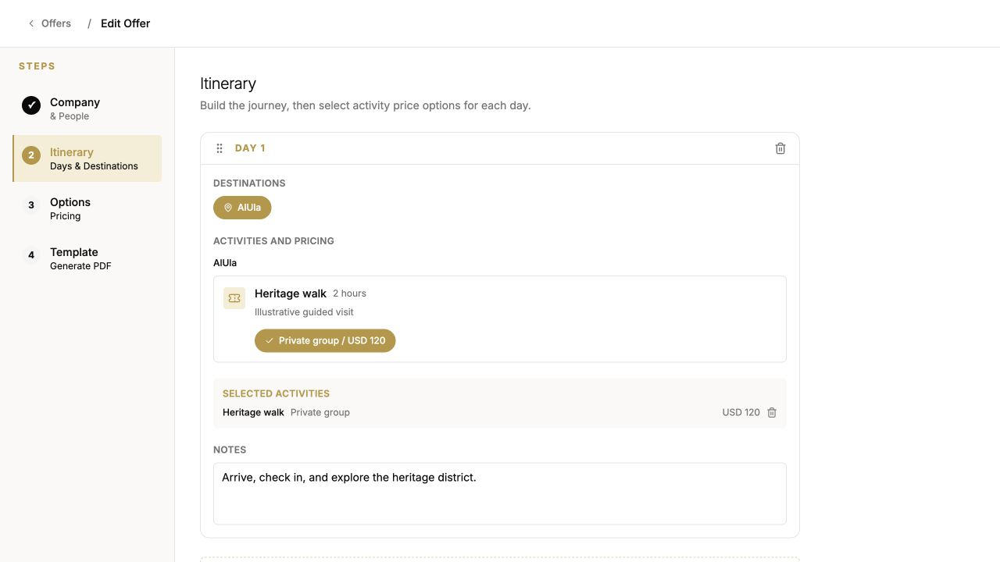
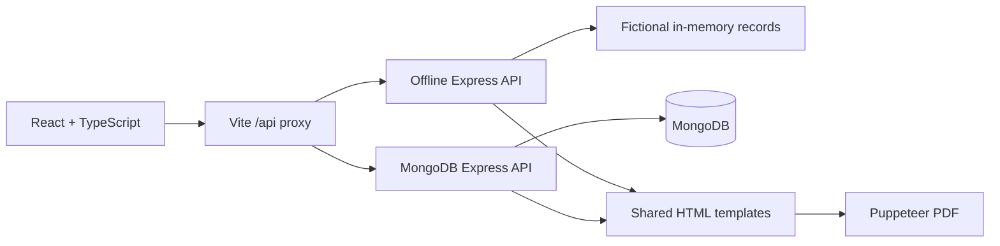

<p align="center"></p>

[](https://github.com/The7areth/travel-operations/actions/workflows/ci.yml)

**Plan an offer, organize the guests, and generate the documents from one workspace.**

A full-stack travel operations portfolio by **[Hareth Al-Fawaz](https://github.com/The7areth)**. React and TypeScript provide the workspace; Express handles the API; MongoDB provides the persistent mode; Puppeteer turns structured records into PDFs. A separate in-memory demo makes the workflow easy to try without a database.

[Complete walkthrough](docs/walkthrough.md) · [Run locally](docs/setup.md) · [API guide](docs/api.md) · [Architecture and tradeoffs](docs/architecture.md) · [Verification](docs/verification.md)

## The workflow

| Stage | What the application does |
|---|---|
| Maintain reusable records | Companies, people, hotels, destinations, activities, and price options |
| Build an offer | Select a company and guests, organize itinerary days, choose a template, and define commercial options |
| Prepare operations | Maintain versioned rooming lists and service confirmations |
| Generate documents | Export offer, rooming-list, and service-confirmation PDFs with export metadata |

The repository demonstrates domain modeling, multi-step forms, REST integration, embedded document versions, reference hydration, and HTML-to-PDF rendering. It does not claim measured time savings or production deployment.

## Try the offline demo

Use Node.js 22 and npm. First installation needs internet to download packages and Puppeteer's browser. After installation, the included fixture workflow runs locally without MongoDB or external images.

```sh
git clone https://github.com/The7areth/travel-operations.git
cd travel-operations
npm ci
npm ci --prefix server
npm ci --prefix client
npm run demo
```

Open **http://localhost:5173**. API: **http://127.0.0.1:3001/api/health**. Stop with Ctrl+C.

**Offline mode keeps changes in memory: restarting resets the data.** All bundled guests, companies, contacts, bookings, and prices are fictional. Remote image lookup needs internet; the offline PDF renderer blocks remote resources. Persistent setup and troubleshooting are in [setup.md](docs/setup.md).



## Architecture



Run one API mode at a time; both use port 3001. The browser uses the same API paths in either mode. The demo is a separate implementation, so it is not a substitute for database integration testing.

## Explore the implementation

| Area | Source |
|---|---|
| Navigation and screens | [client/src/App.tsx](client/src/App.tsx) |
| Offer wizard | [OfferWizard.tsx](client/src/pages/offers/OfferWizard.tsx) |
| API calls and client types | [client/src/lib/api.ts](client/src/lib/api.ts) |
| Offline API and fictional data | [server/src/demo](server/src/demo) |
| Persistent API | [server/src/routes](server/src/routes) |
| Domain schemas | [server/src/models](server/src/models) |
| Document rendering | [server/src/pdf/template.js](server/src/pdf/template.js) |

## Verification

```sh
npm run build
npm test
```

The build type-checks the client and creates the Vite bundle. Tests exercise demo CRUD, real MongoDB CRUD and reference hydration, validation, missing records, protected export history, real PDF responses, failure recovery, and HTML escaping. CI repeats the build and tests on Linux; see the live badge and [verification record](docs/verification.md).

## Current boundaries

This is a **local portfolio application**, with no authentication or role-based access. Do not expose the API to the public internet or use it with real traveler information as-is. The template editor stores blocks, but the current PDF renderer uses fixed layouts rather than interpreting those blocks. Version records are editable embedded documents, not immutable audit history. Exports record metadata, not archived copies of the PDF bytes. See the [architecture guide](docs/architecture.md) for the remaining engineering tradeoffs.

## Contributing and reuse

See [CONTRIBUTING.md](CONTRIBUTING.md). No open-source license is granted in this publication; contact the author about reuse. Third-party dependencies retain their own licenses. All bundled demo records are independently fictionalized.
